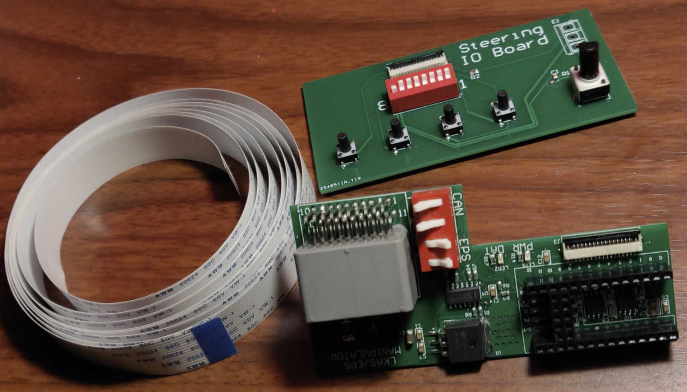

# LKAS/ECU Manipulator

This is open source hardware for use with 2016/2017 Honda Accord's with Nidec camera units. Other form factors aren't guaranteed to fit - use at your own risk!

# Boards

There are two boards in this package:
1. The LKAS/ECU Manipulator
2. The debug board

To connect the debug board to the LKAS/ECU Manipulator a 15 position 0.1" ribbon cable should be used. This is needed for debugging and testing different scenarios.
## LKAS/ECU Manipulator

Below is the basic layout and functions of the board. 

The board consists of: 
- A comparator for-
	- Level shifting the 12V to 3.3V to read serial information.
	- Level shifting the 3.3V UART to 12V to transmit on the vehicles serial line.
- Two MCP2562FDs for-
	- Transmitting/ receiving F-CAN from the vehicle
	- Transmitting/ receiving F-CAN to the camera unit.
		- **Note**: Typically this is not used.
- Debug Connector with GPIO and an ADC input
- Teensy 4.0 

When mounted the board is slightly larger than the the factory cover can contain. 

## Debug Board
The board consists of: 
- A connection for a potentiometer **OR** a 3 block terminal for external resistance.
	- **Note**: This is current limited resulting in slightly lower/higher ADC readout values.
- 4 Tactile Push Buttons 
- 8 Position DIP Switch
	- *DIP 1-7* are digital IO
	- *DIP 8* to onboard POT/ External Pot
- Ribbon cable connector
## Firmware
For the latest OP open source firmware - visit:
[https://github.com/reddn/AccordManualSteering](https://github.com/reddn/AccordManualSteering)

In the Firmware Folder is an example sketch which simulates can simulate a brief torque to the steering wheel.

## In Progress:
Currently in development is a smaller, more universal version of the EPS/LKAS Manipulator.

## License and Terms of Use:

Released under the MIT license.

**THIS IS ALPHA QUALITY HARDWARE AND IS INTENDED FOR OFF-ROAD USE AND RESEARCH PURPOSES ONLY.
YOU ARE RESPONSIBLE FOR COMPLYING WITH LOCAL LAWS AND REGULATIONS.
NO WARRANTY EXPRESSED OR IMPLIED.**

